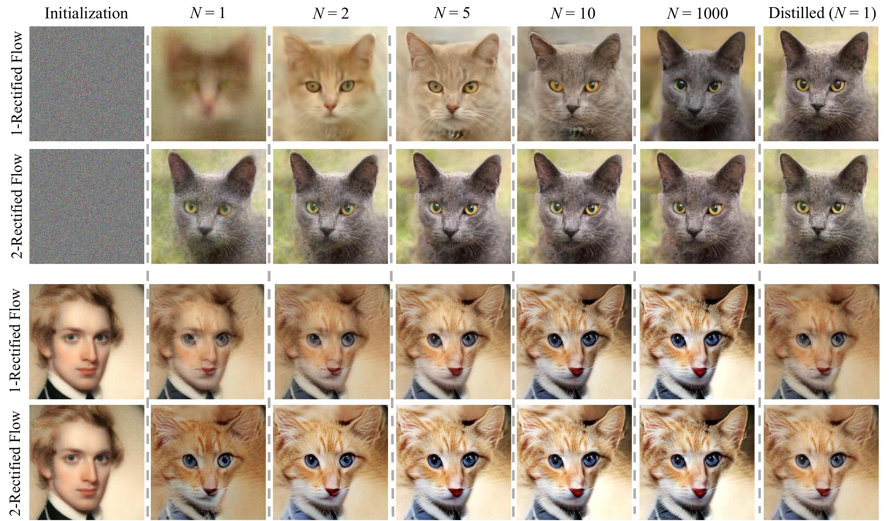
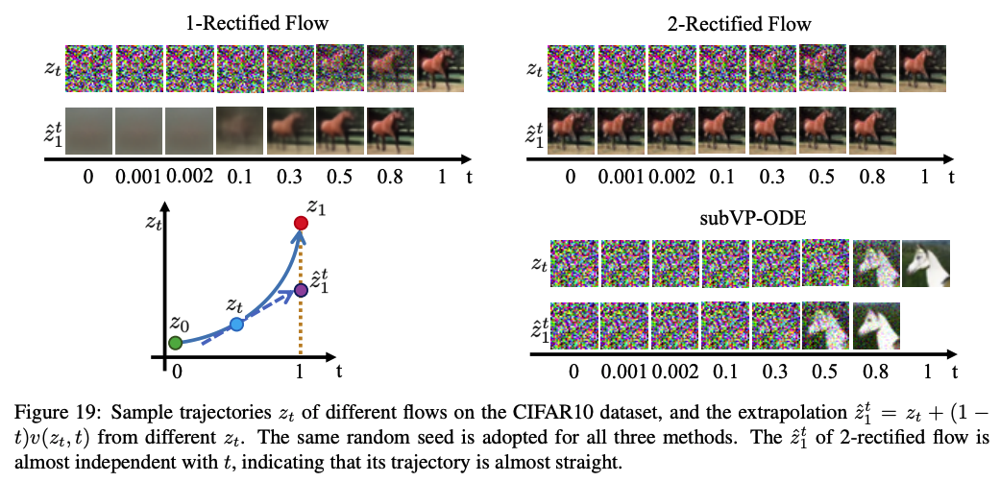

# RectifiedFlow

This is the official implementation of paper 
## [Flow Straight and Fast: Learning to Generate and Transfer Data with Rectified Flow](https://arxiv.org/abs/2209.03003) 
by *Xingchao Liu, Chengyue Gong, Qiang Liu* from UT Austin

## Introduction

Rectified Flow is a novel method for learning transport maps between two distributions $\pi_0$ and $\pi_1$, by connecting **straight paths** between the samples and learning an ODE model.

Then, by a **reflow** operation, we iteratively straighten the ODE trajectories to eventually achieve **one-step** generation, with higher diversity than GAN and better FID than fast diffusion models.

An introductory website can be found [here](https://www.cs.utexas.edu/~lqiang/rectflow/html/intro.html) and the main idea is illustrated in the following figure:


Rectified Flow can be applied to both generative modeling and unsupervised domain transfer, as shown in the following figure:



For a more thorough inspection on the theoretical properties and its relationship to optimal transport, please refer to [Rectified Flow: A Marginal Preserving Approach to Optimal Transport](https://arxiv.org/abs/2209.14577)

## Interactive Colab notebooks
We provide interactive tutorials with Colab notebooks to walk you through the whole pipeline of Rectified Flow. We provide two versions with different velocity models, [neural network version](https://colab.research.google.com/drive/1CyUP5xbA3pjH55HDWOA8vRgk2EEyEl_P?usp=sharing) and [non-parametric version](https://colab.research.google.com/drive/1g8Fm_S4BqrDaG2eHI3sDulBD3WbK2D_V?usp=sharing)

## Image Generation

The code for image generation is in ```./ImageGeneration ```. Run the following command first

```
cd ./ImageGeneration
```

### Dependencies
Run the following to install a subset of necessary python packages for our code

```
pip install -r requirements.txt
```

### Train 1-Rectified Flow
Run the following command to train a 1-Rectified Flow from scratch

```
python ./main.py --config ./configs/rectified_flow/cifar10_rf_gaussian_ddpmpp.py --eval_folder eval --mode train --workdir ./logs/1_rectified_flow
```

* ```--config``` The configuration file for this run.

* ```--eval_folder``` The generated images and other files for each evaluation during training will be stroed in ```./--workdir/--eval_folder```. In this command, it is ```./logs/1_rectified_flow/eval/```

* ```---mode``` Mode selection for ```main.py```. Select from ```train```, ```eval``` and ```reflow```.


### Generate Data Pair $(Z_0, Z_1)$ with 1-Rectified Flow

### Reflow to get 2-Rectified Flow with the Generated Data Pair

2-Rectified Flow should have a much better performance when using one-step generation $z_1=z_0 + v(z_0, 0)$, as shown in the following figure:



We can further improve the quality of 2-Rectified Flow in one-step generation with distillation.

### Distill to get one-step 2-Rectified Flow 


### Distill to get k-step 2-Rectified Flow (k>1)


### Pre-trained Checkpoints
Work in progress.

## Image-to-Image Translation

Work in progress.

## Citation
If you use the code or our work is related to yours, please cite us:
```
@article{liu2022flow,
  title={Flow straight and fast: Learning to generate and transfer data with rectified flow},
  author={Liu, Xingchao and Gong, Chengyue and Liu, Qiang},
  journal={arXiv preprint arXiv:2209.03003},
  year={2022}
}
```

## Thanks
A Large portion of this code base is built upon [Score SDE](https://github.com/yang-song/score_sde_pytorch).
